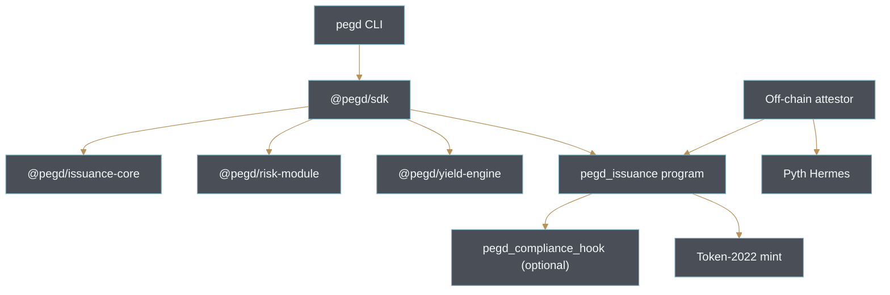

<div align="center">


# Pegd

**Every dollar, calibrated.**

The first white-label stablecoin issuance framework on Solana.

[Website](https://pegd.money) . [X/Twitter](https://x.com/pegdmoney) . [Docs](./docs/architecture.md)

[](https://github.com/pegd-money/pegd/actions)
[](./LICENSE)
[](https://www.rust-lang.org)
[](https://www.anchor-lang.com)
[](https://solana.com)
[](https://spl.solana.com/token-2022)
[](https://www.typescriptlang.org)
[](https://www.npmjs.com/package/pegd-cli)
[](./docs/architecture.md)
[](https://x.com/pegdmoney)

</div>

---

## Overview

Pegd is a Solana-native stablecoin issuance framework. A protocol, DAO, or fintech can register a token, deposit collateral, and mint a stable that is continuously calibrated against a live Proof-of-Reserve attestation. The framework composes an Anchor program, a Token-2022 mint, an off-chain attestor, and a small TypeScript surface -- a builder does not need to write on-chain code to ship a stable that participates in the Pegd trust surface.

The design borrows the vocabulary of the *Bureau International des Poids et Mesures*. A single verified reserve prototype defines the peg. Every stable minted through the framework is calibrated against that prototype and the reserve inspector can be queried at any time.

## Architecture



A complete architecture write-up lives in [docs/architecture.md](./docs/architecture.md). Issuance semantics are captured in [docs/issuance-spec.md](./docs/issuance-spec.md) and Proof-of-Reserve encoding in [docs/por-spec.md](./docs/por-spec.md).

## Issuance Vault and Collateral Modes

`programs/pegd_issuance` owns the on-chain vault. It ships with three collateral modes:

- **Crypto Overcollateralized** -- a 15000 bps floor by default. Volatile collateral is compensated for by generous headroom.
- **Attested Fiat Reserves** -- a 10100 bps floor. Requires an off-chain attestor that holds a signing key nominated at deposit time.
- **RWA Backed** -- a 10500 bps floor. Reserve value tracks a tokenized real-world basket.

The public mirror only exercises the crypto-overcollateralized path. Attested-fiat and RWA modes require additional off-chain infrastructure the issuer is responsible for operating -- Pegd does not custody or attest to real dollars.

Excerpt from the mint handler:

```rust
let ratio_bps = ((reserve_value_usd as u128) * 10_000u128 / (new_supply as u128)) as u32;
if ratio_bps < ctx.accounts.config.circuit_bps {
    emit!(CircuitBreakerTriggered {
        stable_mint: meta.mint,
        ratio_bps,
        threshold_bps: ctx.accounts.config.circuit_bps,
    });
    return Err(PegdError::CircuitBreakerTripped.into());
}
require!(ratio_bps >= meta.min_ratio_bps, PegdError::RatioBelowMinimum);
```

## Proof-of-Reserve

`commit_attestation` accepts an attestor-signed `(mint, timestamp, total_supply, reserve_value_usd, ratio_bps, signature)` tuple. The program enforces:

- `timestamp <= now` and `now - timestamp <= 3600`.
- `ratio_bps == floor(reserve_value_usd * 10_000 / total_supply)`.
- The signature byte string is non-zero. Full Ed25519 curve verification is delegated to a preceding `ed25519_program` instruction.

Consumers can read the resulting attestation without re-verifying it -- the on-chain guards are sufficient to render a "Reserves verified by Pegd" badge or gate business logic.

## Yield Engine

`@pegd/yield-engine` wraps the Token-2022 `InterestBearingConfig` extension. A yield stable is initialized with a rate authority and a rate in basis points; consumers query the accrual math through `amountToUiAmount` without needing to talk to the mint directly. The Anchor program caps the initial rate at 5000 bps to avoid accidental hyperinflationary settings; higher rates require an explicit admin change.

## Risk Module and Circuit Breaker

`@pegd/risk-module` mirrors the on-chain thresholds and adds ergonomic helpers:

- `classifyRatio(ratioBps)` returns one of `HEALTHY`, `WARNING`, `LIQUIDATION`, `CIRCUIT_TRIPPED`, or `UNDER_PEG`.
- `CircuitBreaker` tracks the last observed ratio, trips itself when the ratio falls below the breaker threshold, and refuses to reset while the observed ratio is still below.
- `planPartialLiquidation` computes how much supply must be liquidated to bring a position back to the minimum ratio and returns the projected post-liquidation ratio without silently clipping.

Both the on-chain program and the risk module hold the same thresholds. This is intentional redundancy -- the off-chain breaker prevents a UI from optimistically proceeding while the on-chain breaker prevents the actual mint from settling.

## Compliance Hooks

`programs/pegd_compliance_hook` is an optional Token-2022 transfer hook. It gates transfers behind an on-chain allowlist and is only wired up when the issuer opts in at registration time. Consumers that do not need a compliance surface can ignore this program entirely. Compliance is not the headline of Pegd -- it is a switch a regulated issuer can flip on if their jurisdiction requires it.

## CLI and SDK

Install the CLI from a workspace build:

```
pnpm --filter pegd-cli build
node ts/cli/dist/cli.js --help
```

Typical usage:

```
pegd config:set --rpc https://api.mainnet-beta.solana.com --cluster mainnet-beta
pegd issue USDpg --peg USD --collateral crypto --target 1000000
pegd reserves <mint>
pegd stress --mode crypto --collateral 1500000 --issued 1000000 --shock 30
```

The SDK wraps the same surface as a library:

```ts
import { PegdIssuer } from '@pegd/sdk';
import { CollateralMode } from '@pegd/issuance-core';

const issuer = new PegdIssuer(connection, wallet, {
  programId: PEGD_PROGRAM_ID,
  cluster: 'mainnet-beta',
});

const quote = issuer.quoteMint({
  mode: CollateralMode.OvercollateralizedCrypto,
  collateralValueUsd: new BN(1_500_000),
  targetIssuanceUsd: new BN(1_000_000),
});

if (!quote.canIssue) {
  throw new Error('Requested issuance would breach the minimum ratio.');
}
```

## Building

Requirements: Rust 1.79+, Anchor CLI 0.31.1, Solana toolchain 1.18, Node 20+, pnpm 9+.

```
pnpm install
pnpm -r --parallel typecheck
cargo check --workspace
```

Anchor integration tests exercise the initialize / register / deposit / mint / burn / attest paths against a local validator via `anchor test`.

## Repository Layout

```
pegd/
  programs/
    pegd_issuance/         Anchor program (issuance vault, PoR attestation)
    pegd_compliance_hook/  Optional Token-2022 transfer hook
  ts/
    issuance-core/         Quote math and collateral modes
    risk-module/           Circuit breaker, thresholds, liquidation planner
    yield-engine/          Token-2022 interest-bearing wrappers
    sdk/                   @pegd/sdk PegdIssuer client
    cli/                   pegd command line front-end
  tests/                   Anchor integration tests
  docs/                    Architecture, issuance spec, PoR spec, security notes
```

## Security

Vulnerability reports go to `security@pegd.money`. See [SECURITY.md](./SECURITY.md) for the full disclosure policy, supported versions, and audit status. No third-party audit has been completed at the time of writing -- an external review is planned before the v1.0.0 mainnet cutover, and the README will link the auditor and the final report once the audit closes.

## License

Pegd is released under the [MIT license](./LICENSE). Contributions are welcomed under the same terms; see [CONTRIBUTING.md](./CONTRIBUTING.md) for the local development flow and coding conventions.
