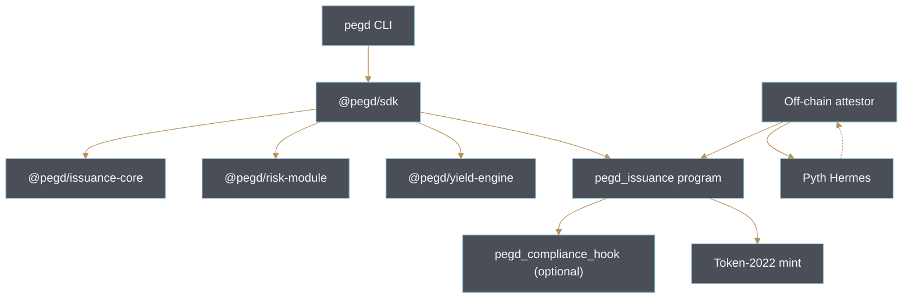
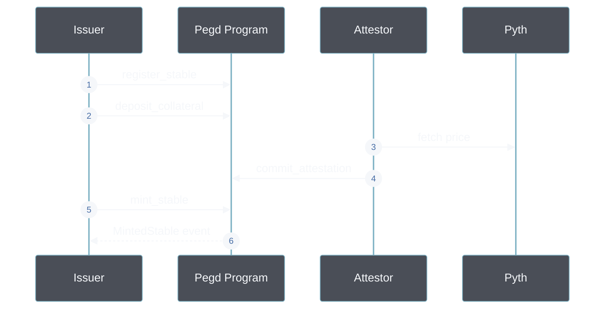

# Pegd Architecture

Pegd is a white-label stablecoin issuance framework for Solana. It ships as a small set of composable modules -- an Anchor program that holds the issuance vault, a Proof-of-Reserve attestation surface, a set of TypeScript packages that model collateral, risk, and yield, and a CLI/SDK that a builder can wire into a product without writing its own on-chain code.

## Overview

At the highest level three roles interact with the framework:

1. **Issuer** -- registers a stablecoin, deposits collateral, and mints or burns the token.
2. **Attestor** -- signs Proof-of-Reserve reports off-chain and commits them on-chain.
3. **Consumer** -- reads reserves through the SDK, either to render a badge, drive a UI, or gate business logic.

## Component Diagram

`@pegd/sdk` is the public entrypoint. `@pegd/issuance-core` holds pure math for quotes and required collateral. `@pegd/risk-module` classifies ratios, models the circuit breaker, and plans partial liquidations. `@pegd/yield-engine` wraps the Token-2022 interest-bearing extension so a yield stable can be spun up from the same surface.

## On-chain State

The `pegd_issuance` Anchor program owns four account types:

| Account              | Seeds                                              | Purpose                                                        |
|----------------------|-----------------------------------------------------|----------------------------------------------------------------|
| `Config`             | `pegd_config`                                       | Global admin, treasury, and ratio thresholds.                 |
| `StablecoinMeta`     | `stable_meta`, mint pubkey                          | Per-mint issuer identity, mode, and outstanding supply.       |
| `VaultState`         | `vault_state`, mint pubkey                          | Collateral mint, oracle, current collateral amount.           |
| `ReserveAttestation` | `reserve_attestation`, mint pubkey                  | Latest attestor-signed snapshot with ratio and signature.     |

`Config` is a singleton. The remaining three accounts are per stablecoin. All PDAs are derived deterministically from the mint pubkey, so the SDK can look up any stable without an index.

## Mint Flow

`mint_stable` recomputes the ratio from the current supply and the reserve value being reported by the caller. It rejects the mint if the ratio would fall below the per-mint minimum, and it hard-stops with a `CircuitBreakerTripped` event if the ratio would fall below the global circuit threshold.

## Off-chain Attestation

Attestations are Ed25519 signatures over a canonical `(stable_mint, timestamp, total_supply, reserve_value_usd, ratio_bps)` tuple. The on-chain program enforces two invariants:

- `timestamp <= now` and `now - timestamp <= 3600` seconds.
- `ratio_bps == floor(reserve_value_usd * 10_000 / total_supply)`.

Attestors typically fetch collateral prices from Pyth Hermes, snapshot the on-chain vault, and sign the tuple with a Solana keypair whose pubkey is recorded during `deposit_collateral`.

## TypeScript Packages

- `@pegd/issuance-core` exports `CollateralMode`, `quoteIssuance`, `quoteBurn`, `calculateCollateralRatio`, and `requiredCollateralForIssuance`.
- `@pegd/risk-module` exports `RatioZone`, `classifyRatio`, `CircuitBreaker`, `planPartialLiquidation`, and `LiquidationQueue`.
- `@pegd/yield-engine` builds Token-2022 interest-bearing initialize and rate-update instructions, and provides accrual math for read-side UIs.
- `@pegd/sdk` composes the three packages behind a single `PegdIssuer` class that resolves PDAs, builds instructions, and reads reserve snapshots.

## CLI

`pegd-cli` wraps the SDK. It exposes `pegd issue`, `pegd mint`, `pegd burn`, `pegd reserves`, `pegd por`, `pegd stress`, and `pegd config`. The stress command runs a downside shock against a synthetic collateral position and reports whether the circuit breaker would trip.

## Compliance Hook

`pegd_compliance_hook` is an optional Token-2022 transfer hook that gates transfers behind an on-chain allowlist. It is only wired up when the issuer sets `has_compliance_hook = true` during `register_stable`. Consumers that do not need a compliance surface can ignore this program entirely.
