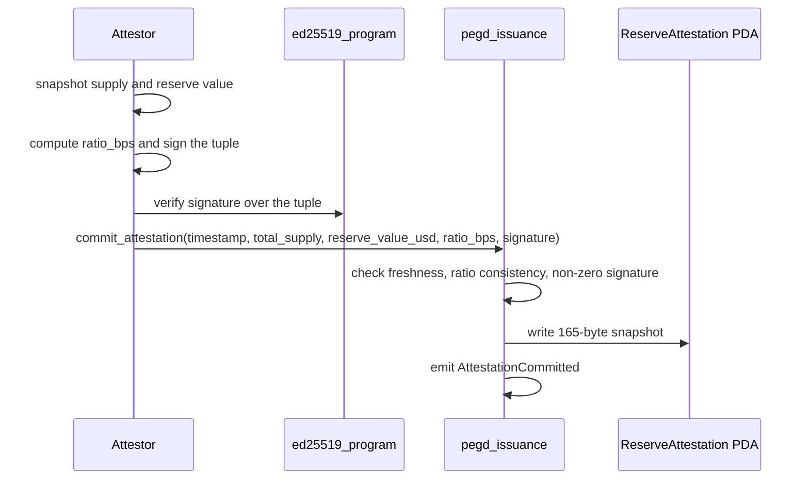

# Reserve Attestation Account Layout

This document is a byte-level reference for the `ReserveAttestation` account written by
`commit_attestation`. It complements [por-spec.md](./por-spec.md), which describes the
signed payload and the attestor pipeline; here the focus is the on-chain account bytes and
the invariants the program enforces before it writes them.

The authoritative definition lives in
`programs/pegd_issuance/src/state/attestation.rs`. The account is a fixed 165 bytes and is
stored at the PDA `["reserve_attestation", stable_mint]` under the program id.

## Field layout

Offsets are measured from the start of the account data, including the 8-byte Anchor
discriminator. All integers are little-endian.

| Offset | Size | Field | Type | Notes |
| --- | --- | --- | --- | --- |
| 0 | 8 | discriminator | `[u8; 8]` | Anchor account discriminator for `ReserveAttestation`. |
| 8 | 32 | `stable_mint` | `Pubkey` | Token-2022 mint this attestation covers. |
| 40 | 8 | `timestamp` | `i64` | Unix seconds the attestor stamped the snapshot. |
| 48 | 8 | `total_supply` | `u64` | Raw token units outstanding at snapshot time. |
| 56 | 8 | `reserve_value_usd` | `u64` | Reserve value in USD with 6-decimal precision. |
| 64 | 4 | `ratio_bps` | `u32` | Collateral ratio in basis points. |
| 68 | 32 | `attestor` | `Pubkey` | Signer that committed the snapshot. |
| 100 | 64 | `signature` | `[u8; 64]` | Ed25519 signature over the attested tuple, stored verbatim. |
| 164 | 1 | `bump` | `u8` | PDA bump seed. |

Total: `8 + 32 + 8 + 8 + 8 + 4 + 32 + 64 + 1 = 165` bytes, matching
`ReserveAttestation::LEN`.

## On-chain invariants

Before writing the account, `commit_attestation` enforces the following. Each failing
check aborts the instruction with the listed error; see
[error-codes.md](./error-codes.md) for the numeric codes.

- `timestamp <= now`, otherwise `FutureAttestation`.
- `now - timestamp <= 3600`, otherwise `StaleAttestation`.
- `ratio_bps == floor(reserve_value_usd * 10000 / total_supply)`, otherwise
  `ReservesUnderCollateral`. When `total_supply` is zero the recomputed ratio is zero, so
  `ratio_bps` must also be zero.
- The `signature` byte string contains at least one non-zero byte, otherwise
  `AttestorSignatureInvalid`.

On first write the program also fixes `stable_mint` and `bump`; subsequent commits reuse
the same PDA and overwrite the mutable snapshot fields. The `attestor` field always records
the current signer, and `StablecoinMeta.reserves_value_usd` is updated to the freshly
committed `reserve_value_usd`.

## Attested tuple

The attestor signs the canonical encoding of the tuple

```
(stable_mint, timestamp, total_supply, reserve_value_usd, ratio_bps)
```

The `attestor`, `signature`, and `bump` fields are program-side bookkeeping and are not part
of the signed message. Full Ed25519 curve verification is expected to run in a preceding
`ed25519_program` instruction in the same transaction; the on-chain non-zero check is a
sanity guard, not a substitute for that verification.

## Commit sequence


