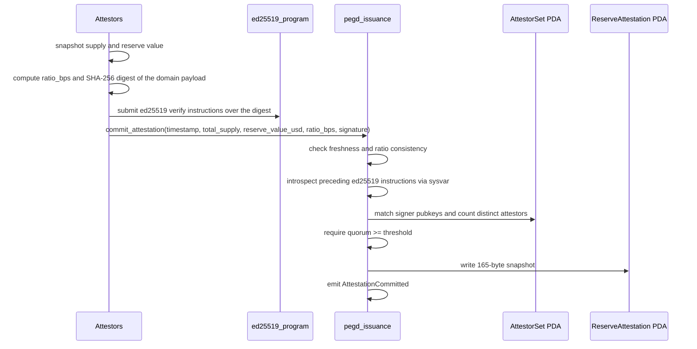

# Reserve Attestation Account Layout

This document is a byte-level reference for the `ReserveAttestation` account written by
`commit_attestation`. It complements [por-spec.md](./por-spec.md), which describes the
signed payload and the attestor pipeline; here the focus is the on-chain account bytes and
the invariants the program enforces before it writes them.

The authoritative definition lives in
`programs/pegd_issuance/src/state/attestation.rs`. The account is a fixed 165 bytes and is
stored at the PDA `["reserve_attestation", stable_mint]` under the program id.

## Field layout

Offsets are measured from the start of the account data, including the 8-byte Anchor
discriminator. All integers are little-endian.

| Offset | Size | Field | Type | Notes |
| --- | --- | --- | --- | --- |
| 0 | 8 | discriminator | `[u8; 8]` | Anchor account discriminator for `ReserveAttestation`. |
| 8 | 32 | `stable_mint` | `Pubkey` | Token-2022 mint this attestation covers. |
| 40 | 8 | `timestamp` | `i64` | Unix seconds the attestor stamped the snapshot. |
| 48 | 8 | `total_supply` | `u64` | Raw token units outstanding at snapshot time. |
| 56 | 8 | `reserve_value_usd` | `u64` | Reserve value in USD with 6-decimal precision. |
| 64 | 4 | `ratio_bps` | `u32` | Collateral ratio in basis points. |
| 68 | 32 | `attestor` | `Pubkey` | Signer that committed the snapshot. |
| 100 | 64 | `signature` | `[u8; 64]` | Ed25519 signature over the attested tuple, stored verbatim. |
| 164 | 1 | `bump` | `u8` | PDA bump seed. |

Total: `8 + 32 + 8 + 8 + 8 + 4 + 32 + 64 + 1 = 165` bytes, matching
`ReserveAttestation::LEN`.

## On-chain invariants

Before writing the account, `commit_attestation` enforces the following. Each failing
check aborts the instruction with the listed error; see
[error-codes.md](./error-codes.md) for the numeric codes.

- `timestamp <= now`, otherwise `FutureAttestation`.
- `now - timestamp <= 3600`, otherwise `StaleAttestation`.
- `ratio_bps == floor(reserve_value_usd * 10000 / total_supply)`, otherwise
  `ReservesUnderCollateral`. When `total_supply` is zero the recomputed ratio is zero, so
  `ratio_bps` must also be zero.
- At least `AttestorSet.threshold` distinct registered attestors must have produced a valid
  ed25519 signature over the attestation digest, otherwise `QuorumNotMet`. This replaces the
  earlier non-zero-byte sanity check: the program now performs real signature introspection
  rather than trusting the stored `signature` bytes.

On first write the program also fixes `stable_mint` and `bump`; subsequent commits reuse
the same PDA and overwrite the mutable snapshot fields. The `attestor` field always records
the current signer, and `StablecoinMeta.reserves_value_usd` is updated to the freshly
committed `reserve_value_usd`. When `ratio_bps` falls below `config.circuit_bps` the commit
trips `StablecoinMeta.breaker_tripped` and emits `CircuitBreakerTriggered`; when it recovers
to or above the stable's `min_ratio_bps` the breaker is cleared.

## Attestor set and quorum

Signing authority is not implicit in the `attestor` signer. An admin registers an explicit
`AttestorSet` PDA at `["attestor_set"]` via `configure_attestors`, holding a `threshold` and
up to five authorized attestor pubkeys. `commit_attestation` only counts signatures from
pubkeys that `AttestorSet::contains` recognizes, and requires at least `threshold` distinct
matches. See [error-codes.md](./error-codes.md) for `InvalidAttestorConfig` and
`QuorumNotMet`.

## Attested digest and ed25519 introspection

The attestors sign a domain-separated 71-byte payload, not the raw tuple:

```
"PEGD-POR-V1" || stable_mint || timestamp_le || total_supply_le || reserve_value_usd_le || ratio_bps_le
```

`commit_attestation` reconstructs this payload, hashes it with SHA-256 to form the 32-byte
digest, then walks every preceding instruction in the transaction through the Instructions
sysvar. For each `ed25519_program` instruction it parses the ed25519 offset headers and
counts a signature only when its signature, public key, and message all live inside that
same instruction's data (self-reference offsets), the message equals the digest exactly, and
the public key is a registered attestor. Cross-instruction references are skipped
conservatively. The stored `signature`, `attestor`, and `bump` fields remain program-side
bookkeeping and are not part of the signed message; on-chain enforcement now comes from the
sysvar introspection and quorum count above, not from the stored bytes.

## Commit sequence


